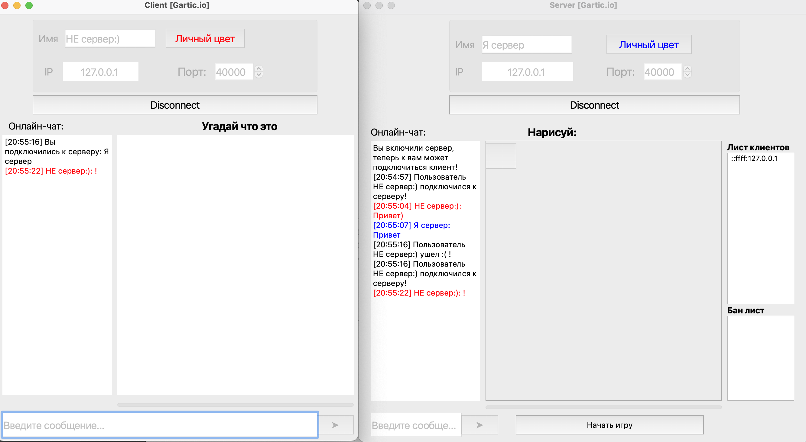
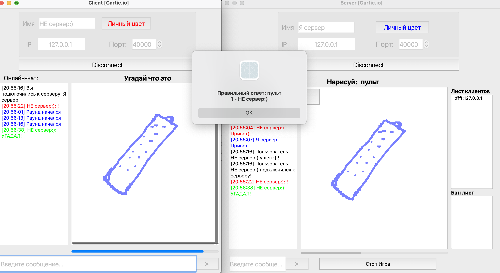

# QTcpGame
Улучшение многопользовательского чата на TCP/IP | C++ | Qt

# О проекте:
Идея основана на игре Gartic.io

💬: Многопользовательский чат  
🎨: Выбор персонального цвета пользователя и цвета ручки для рисования  
⛔️: Возможность блокировать пользователя по IP  
🔓: Защита сообщений от HTML-инъекций  

# Визуальная часть:   
Общение в чате:   
  
Пример раунда:  
  

